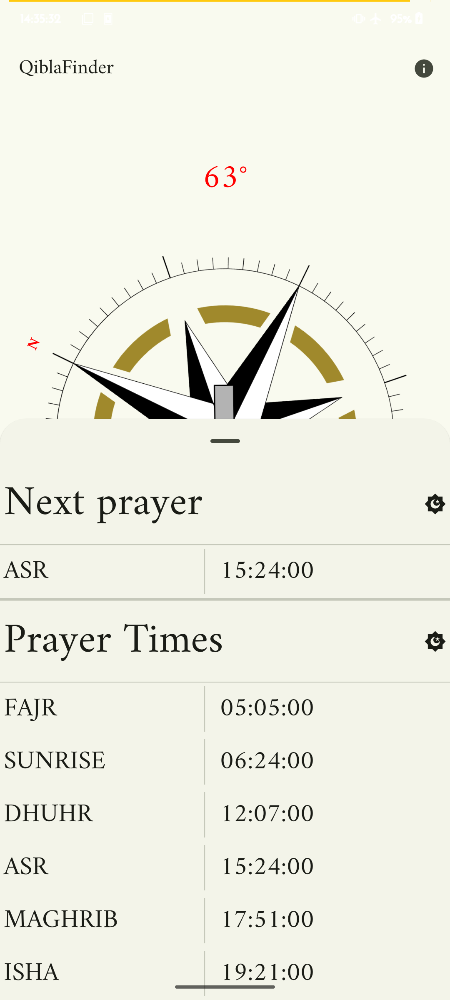

# QiblaFinder

Qibla Finder is a minimal, open-source Android app that helps users determine the Qibla direction and shows prayer times. Built as a demonstration of modern Android development skills, it emphasizes clean architecture, efficiency, and privacy. Simple and minimal design

## Engineering Highlights

- Fully built with Jetpack Compose for a modern, declarative UI.
- Implements MVVM architecture for clean separation of concerns.
- Displays prayer times based on user location.
- Lightweight and optimized for minimal size.
- No tracking or analytics—completely privacy-focused.
- Free and open-source.

## Architecture & Technical Stack

- Language: Kotlin
- UI: Jetpack Compose
- Architecture: MVVM (Model-View-ViewModel)
- Android Development: Modern Android practices (ViewModel, LiveData/StateFlow, Hilt optional)
- Build System: Gradle Kotlin DSL with Version Catalogs (libs.versions.toml) for centralized dependency management.

## Screenshot

### Prayer Times

## Installation

Clone this repository and run `gradlew` in the project directory of this repository.